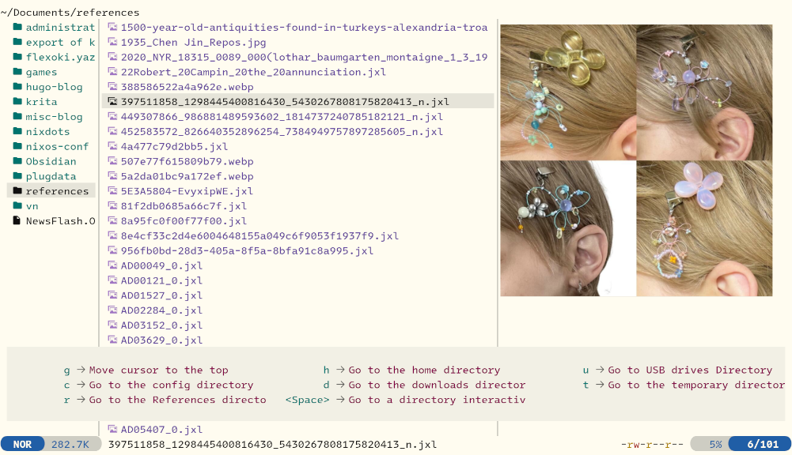

<div align="center">
  
</div>

<h3 align="center">
    <a href="https://github.com/kepano/flexoki">Flexoki</a> Light Flavor for <a href="https://github.com/sxyazi/yazi">Yazi</a>
</h3> 

## 👀 Preview



## 🎨 Installation

```bash
ya pack -a foldfree/flexoki-light
```

## ⚙️ Usage

Add these lines to your `theme.toml` configuration file to use it:

```toml
[flavor]
use = "flexoki-light"
```
## 🌙 Flexoki Dark?

-> https://github.com/Reledia/flexoki.yazi

## :accessibility: Disclaimer

This is not a 1:1 port of Flexoki, contrast have been improved in some places for legibility purposes with the help of the <a href="https://www.myndex.com/APCA/">APCA contrast tool</a>.

## 📜 License

The flavor is MIT-licensed, and the included tmTheme is also MIT-licensed.

Check the [LICENSE](LICENSE) and [LICENSE-tmtheme](LICENSE-tmtheme) file for more details.
